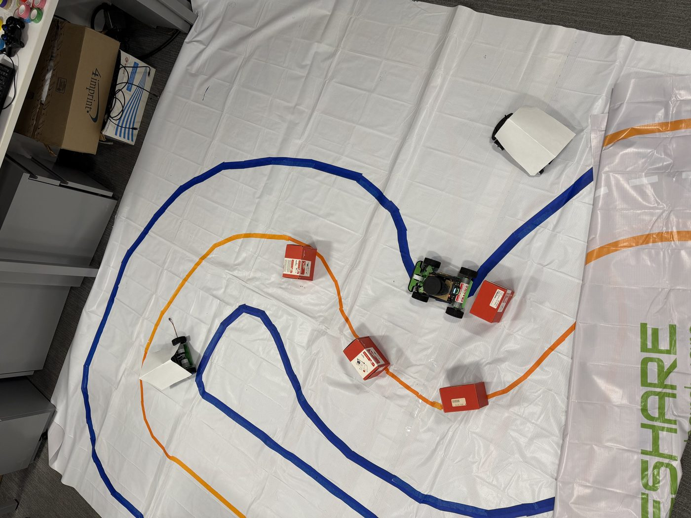
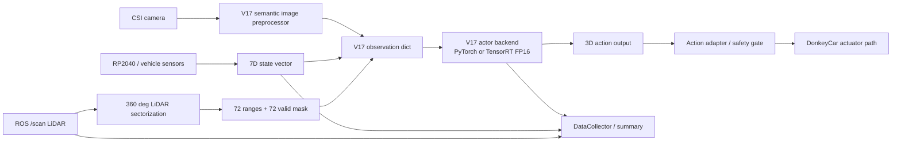
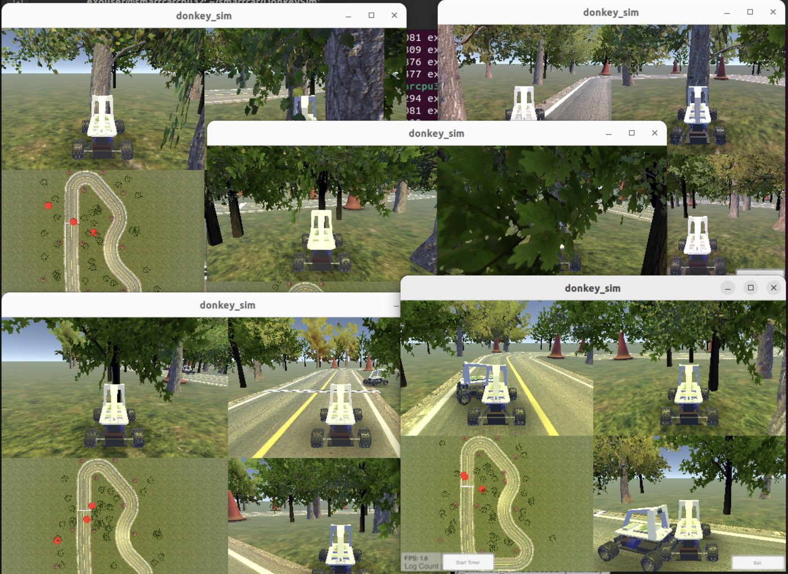
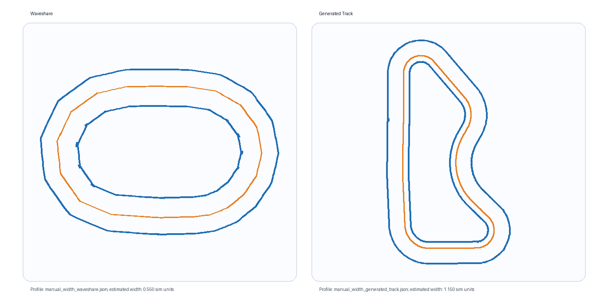

# DonkeyCar RL Racing: Jetson Edge AI Runtime

A DonkeyCar / Jetson project covering multi-scene reinforcement-learning training, camera-LiDAR observation design, sim-to-real alignment, and V17 endpoint deployment with ONNX/TensorRT FP16 inference, LiDAR sectorization, runtime monitoring, asynchronous logging, telemetry caching, safety gates, and long-duration shadow validation.

This repository is best read as a **Robotics Software / Edge AI Systems** portfolio project: the strongest evidence is the edge runtime engineering and deployment validation, not just the reinforcement-learning training loop.



## V17 Edge Runtime Summary

Supported claim:

> V17 was deployed on Jetson as an observable, reproducible, safety-gated endpoint runtime with ONNX/TensorRT actor inference, LiDAR sectorization, asynchronous logging, telemetry caching, shadow validation, and failure-gate checks.

Unsupported claim:

> V17 has validated real-car obstacle avoidance or active closed-loop racing performance.

## Key Results

| Area | Result |
|---|---:|
| TensorRT actor residual p50 | 25.856 ms -> 12.479 ms |
| TensorRT actor residual p95 | 40.988 ms -> 17.046 ms |
| LiDAR/DataCollector optimized V17 p50 | 168.570 ms -> 87.153 ms |
| LiDAR/DataCollector optimized V17 p95 | 253.958 ms -> 124.753 ms |
| Optimized effective FPS mean | 4.270 -> 10.641 |
| Optimized vehicle-loop p95 | 696.175 ms -> 130.800 ms |
| DataCollector p99 | 537.42 ms -> 5.67 ms |
| Final TensorRT shadow validation | 1199.55 s, exit 0 |
| Final shadow safety counters | 0 inference timeout, 0 LiDAR missing, 0 RP2040 missing |

Benchmark details are in [`docs/v17_runtime_benchmark.md`](docs/v17_runtime_benchmark.md) and [`results/v17_benchmark_summary.csv`](results/v17_benchmark_summary.csv).

## Runtime Architecture



In shadow mode, the V17 actor output is logged but does not control actuators. The actuator path remains manual/user-controlled.

## V17 Documentation

| Document | Purpose |
|---|---|
| [`docs/v17_edge_runtime_overview.md`](docs/v17_edge_runtime_overview.md) | Public endpoint-deployment framing, system boundary, architecture, and main results |
| [`docs/v17_onnx_tensorrt_deployment.md`](docs/v17_onnx_tensorrt_deployment.md) | Actor-only ONNX export, TensorRT FP16 engine, runtime integration, action-diff check |
| [`docs/v17_runtime_benchmark.md`](docs/v17_runtime_benchmark.md) | System-level benchmark, actor residual split, final 20-minute shadow result |
| [`docs/v17_safety_shadow_validation.md`](docs/v17_safety_shadow_validation.md) | Preflight checks, safety gates, fault injection, shadow non-takeover |
| [`docs/v17_known_limits.md`](docs/v17_known_limits.md) | Explicit limits: no active autonomy claim, remaining bottlenecks, future work |
| [`Jetson/README.md`](Jetson/README.md) | Jetson runtime components, shadow commands, safety gates, expected logs |

## Visual Context

| DonkeySim multi-view setup | Calibrated track profiles |
|---|---|
|  |  |

The physical track photo is from the smart-car lab setup. The track-profile render is generated from the JSON geometry files in `module/track_data/`, so the figure can be regenerated from repository data.

## Project Highlights

- Multi-scene PPO training pipeline for DonkeyCar simulator tracks, including Waveshare-style narrow tracks and generated-track domains.
- Curriculum learning for obstacle avoidance, progressing from warmup driving to static obstacles, mixed dynamic obstacles, and lane-following NPC vehicles.
- Custom observation and control stack: semantic lane extraction, multi-input observations, high-level speed control, steering safety limits, and reward shaping.
- V17 endpoint deployment with PyTorch/SB3 actor export to ONNX, TensorRT FP16 engine build, and TensorRT runtime integration on Jetson.
- Runtime-system optimization: LiDAR sectorization moved out of the critical path, DataCollector writes made asynchronous, and slow Jetson telemetry reads moved to a background cache.
- Safety validation: preflight checks, stale-sensor gates, inference-timeout counters, and shadow-mode non-takeover.
- Reproducibility-oriented docs covering reward design, map transforms, multisim training, dynamics wrappers, V16 curriculum gates, and V17 endpoint deployment.

## Main Entry Points

| Path | Purpose |
|---|---|
| `src/ppo_multitrack_v16.py` | Dual-domain obstacle curriculum training entrypoint. |
| `module/v14_train.py` and `module/v14_cli.py` | Modular V14 training flow and command-line interface. |
| `module/multi_scene_env.py` | Multi-scene environment switching and observation wrapper stack. |
| `module/reward.py` and `module/v14_wrapper_reward.py` | Reward shaping for progress, safety, off-track risk, and obstacle avoidance. |
| `module/control.py` | High-level steering/throttle control wrappers and safety limits. |
| `module/WS2NewTrack.py`, `module/GT2NewTrack.py`, `module/RRL2NewTrack.py` | Track image conversion and lane/road surface preprocessing tools. |
| `Jetson/runtime_monitor.py` | Runtime monitoring helper for edge deployment experiments. |

## Repository Structure

```text
.
├── src/                  # Training scripts and experiment entrypoints
├── module/               # RL environments, wrappers, rewards, control, perception utilities
├── module/track_data/    # Manual-width track geometry profiles
├── docs/                 # Design notes, training docs, V17 endpoint-deployment docs
├── tools/                # World-model training, evaluation, and deployment utilities
├── Jetson/               # Edge runtime helper scripts and runtime README
├── results/              # Small public benchmark summaries; large logs stay outside Git
├── config.py             # DonkeyCar simulator configuration
├── myconfig.py           # Project-specific runtime configuration
└── train.py / manage.py  # Standard DonkeyCar project entrypoints
```

## Training Command

The current public training path is the V16 dual-domain curriculum:

```bash
python src/ppo_multitrack_v16.py \
  --auto-curriculum \
  --sim remote \
  --port 9091 \
  --track-dir /path/to/track \
  --steps 6000000 \
  --save-dir models/v16_auto_curriculum \
  --exp-tag v16_auto \
  --file-metrics-log-freq 250
```

See [`docs/V16_CURRICULUM.md`](docs/V16_CURRICULUM.md) for stage gates, domain settings, and expected logs.

## Edge Runtime Command Pattern

A representative TensorRT shadow validation command is:

```bash
python runtime_monitor.py drive \
  --model /path/to/v17_model.zip \
  --type v17 \
  --js \
  --control-mode shadow \
  --shadow-duration 1200 \
  --log-dir /path/to/monitor_logs/manual_trt_shadow_20min \
  --run-label manual_trt_shadow_20min \
  --track-condition endpoint_deployment_repro \
  --shadow-engine /path/to/v17_actor_fp16.engine \
  --shadow-engine-metadata /path/to/v17_actor_export.json \
  --force-recording
```

Large model checkpoints, raw run logs, and local hardware paths are intentionally excluded from the public repository.

## Design Notes

- `docs/reward.md` explains the progress/safety reward terms and near-risk ramping behavior.
- `docs/CONTROL_CHAIN.md` documents the steering and throttle wrapper sequence.
- `docs/MULTISIM_TRAINING.md` covers the multi-scene training setup.
- `docs/sim2real_alignment.md` and `docs/lane_extraction.md` describe perception and domain-alignment work.
- `module/README.md` is a detailed index of the modules, classes, and top-level functions.
- The V17 documentation listed above describes the endpoint-deployment path.

## Scope

Large generated training outputs are intentionally not included: simulator logs, model checkpoints, tub data, generated models, and local Unity logs should stay outside Git. The archived development history remains available at https://github.com/Gonglz/DonkeyCar-RL-Racing-archive.
