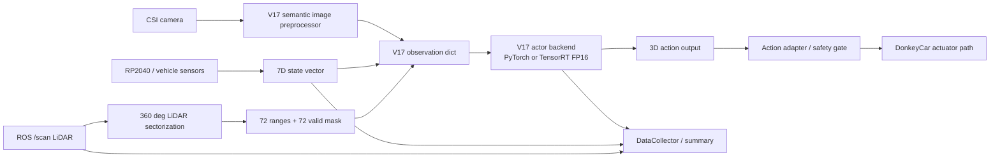

# V17 Edge Runtime Overview

This document summarizes the V17 endpoint-deployment work as an edge robotics runtime project rather than as a pure reinforcement-learning training experiment.

## Public claim

The supported claim is:

> V17 was deployed on Jetson as an observable, reproducible, safety-gated endpoint runtime with ONNX/TensorRT actor inference, LiDAR sectorization, asynchronous logging, telemetry caching, shadow validation, and failure-gate checks.

The unsupported claim is:

> V17 has validated real-car obstacle avoidance or active closed-loop racing performance.

The distinction matters. The completed work validates the endpoint deployment path. It does not claim that the learned policy is ready for autonomous obstacle avoidance.

## System boundary

The endpoint-deployment scope includes:

- PyTorch/SB3 actor export to ONNX.
- TensorRT FP16 actor engine build.
- TensorRT runtime integration through CUDA runtime APIs.
- V17Pilot integration with PyTorch and TensorRT backends.
- 360-degree LiDAR sectorization moved out of the critical loop.
- Asynchronous DataCollector writes for CSV and LiDAR JSONL logs.
- Cached Jetson telemetry to avoid blocking the vehicle loop.
- Engine and metadata preflight checks.
- LiDAR, RP2040, and inference-latency safety gates.
- Shadow-mode validation where the V17 policy output is logged but does not control actuators.

Out of scope:

- Proving obstacle-avoidance success.
- Proving active closed-loop driving.
- Proving full-track completion.
- Rewriting the visual semantic frontend.
- Claiming 20 Hz real-time control.

## Runtime dataflow

In shadow mode, the actor output is recorded for validation and comparison. The actuator path remains under manual/user control.

## Model I/O

The V17 actor is not a single-image CNN. It is a recurrent multi-input policy.

| Input / output | Shape | Meaning |
|---|---:|---|
| `image` | `(1, 6, 128, 128)` | 6-channel semantic image |
| `state` | `(1, 7)` | Vehicle state vector |
| `lidar` | `(1, 144)` | 72 sector ranges + 72 sector valid-mask values |
| `lidar_meta` | `(1, 2)` | LiDAR metadata |
| `h` / `c` | `(2, 1, 256)` | LSTM hidden and cell states |
| `action` | `(1, 3)` | Actor output |
| `next_h` / `next_c` | `(2, 1, 256)` | Updated recurrent state |

## Main engineering results

| Area | Result |
|---|---:|
| TensorRT actor residual p50 | 25.856 ms -> 12.479 ms |
| TensorRT actor residual p95 | 40.988 ms -> 17.046 ms |
| Full V17 latency mean | 229.556 ms -> 199.060 ms |
| Effective FPS mean | 4.199 -> 4.867 |
| Final 20 min shadow run | 1199.55 s, exit 0 |
| Final shadow safety counters | 0 inference timeout, 0 LiDAR missing, 0 RP2040 missing |
| DataCollector p99 in final run | 9.87 ms |

## Why this matters

The strongest part of this project is not the model architecture alone. The stronger hiring signal is the endpoint engineering work:

- fixed-shape actor export;
- TensorRT FP16 deployment on Jetson;
- recurrent-state handling;
- sensor freshness gates;
- non-blocking logging;
- runtime profiling;
- shadow validation before actuator takeover;
- honest separation between deployment stability and policy quality.

That is the correct framing for Robotics Software / Edge AI Systems roles.
